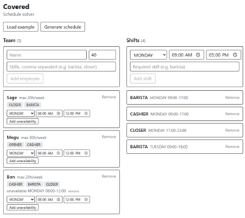

# Covered

**Constraint-based employee shift scheduling.** Describe your team, your shifts, and your rules. Covered finds a schedule that satisfies all of them, or tells you exactly why none exists.

[**→ Live demo**](https://covered-ont2.onrender.com/)




> The demo runs on a free tier that sleeps after 15 minutes idle, so  the first request may take up to a minute to wake and also produce a worst schedule than if you were to run it locally.

---

## What it does

- **Build a team**: names, skills, weekly hour caps, recurring unavailability windows
- **Define shifts**: day of week, start/end time, required skill
- **Solve**: get back a valid assignment, or a specific diagnosis of what makes the problem infeasible
- **Distinguishes violations from warnings**: hard rules broken means the schedule is unusable; soft rules bent means it works but isn't ideal

## The constraint model

The heart of the project. Six constraints in [`ScheduleConstraintProvider`](covered/src/main/java/com/sageb18/covered/service/ScheduleConstraintProvider.java):

| Constraint | Type | Rule |
|---|---|---|
| Missing required skill | hard | An employee must have the skill their shift requires |
| Overlapping shifts | hard | Nobody works two shifts that overlap in time |
| Max hours exceeded | hard | Weekly assigned hours stay within each employee's cap |
| Employee unavailable | hard | No assignment inside a window the employee marked off |
| Daily hours exceeded | hard | No more than 10 hours in a single day |
| Daily overtime | **soft** | Hours past 8 in a day are allowed but penalised |

Hard constraints must all be satisfied for a schedule to be *feasible*. Soft constraints are okay but you should be mindful of them.

The two daily constraints are layered deliberately: `Max hours exceeded` sums the whole week and would happily allow a 14-hour Monday under a 40-hour cap, so `Daily hours exceeded` adds a per-day ceiling and `Daily overtime` penalises the grace band between them.

## Running locally

**Docker**: the whole thing, exactly as deployed:

```bash
docker build -t covered .
docker run -p 8080:8080 covered     # http://localhost:8080
```

**Or separately**: backend needs JDK 21, frontend needs Node 20+:

```bash
cd covered && ./mvnw spring-boot:run     # :8080
cd covered-frontend && npm install && npm run dev     # :5173
```

Vite proxies `/api/*` to `:8080` in development. In production Spring Boot serves the built React app from the jar itself, so the same relative paths work with no CORS configuration.
